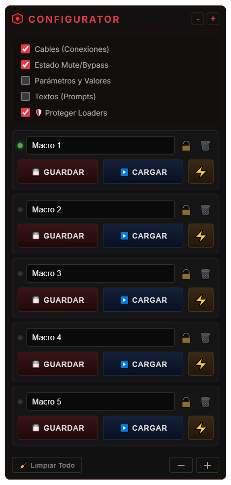

# 🔴 GOM Suite for ComfyUI

Welcome to **GOM Customs**, a collection of advanced, professional-grade nodes for [ComfyUI](https://github.com/comfyanonymous/ComfyUI). 

## 🌟 Featured Node: GOM Workflow Configurator



The **GOM Workflow Configurator** is a "Master Memory" node that injects a full HTML/CSS DOM Widget directly into your ComfyUI canvas. It allows you to save complete workflow states (Macros) and restore them with a single click.

Stop rebuilding your workflows or dragging cables around. Save your setups, protect your loaders, and jump between complex routing paths instantly!

### 🔥 Key Features
*   **Deep State Saving:** Save all your numerical values, combo boxes, seeds, and even text prompts globally.
*   **Surgical Control:** Choose exactly what you want to save/load across 3 main categories:
    *   🔌 **Connections & State:**
        *   **Cables:** Alter routing paths on the fly.
        *   **Mute/Bypass:** Toggle entire branches on or off.
    *   🎛️ **Parameters & Texts:**
        *   **Values:** Save samplers, steps, scales.
        *   **Texts:** Isolated prompt saving so you don't lose your current text.
        *   🛡️ **Protect Loaders:** Automatically ignores heavy model loaders (Checkpoints, VAE, LoRA) to prevent VRAM reloading penalties.
    *   🎨 **Visual Environment:**
        *   **Position & Size:** Moves your nodes back to their saved layout.
        *   **Camera & Zoom:** Instantly teleports your canvas view to the exact area you saved.
        *   **Colors & Titles:** Restores custom node colors, shapes, and titles.
        *   **Native Groups:** Captures and restores ComfyUI group boxes (including their color and sizes).
*   **Professional UI:** A sleek, compact, dark-mode interface that doesn't clutter your screen.
*   **⚡ Instant Render:** The lightning button (`⚡`) loads a preset and automatically queues the prompt.
*   **🔒 Lock Slots:** Lock your favorite presets to prevent accidental overwrites.

---

## 🛠️ Installation

**Method 1: Git Clone (Recommended)**
1. Navigate to your ComfyUI `custom_nodes` folder.
2. Open a terminal and run:
   ```bash
   git clone https://github.com/GomSamurai/ComfyUI-GOM-Suite.git
   ```
3. Restart ComfyUI.

**Method 2: Manual**
1. Download the repository as a ZIP file.
2. Extract the contents into `ComfyUI/custom_nodes/GOM_customs`.
3. Restart ComfyUI.

## 🕹️ How to Use
1. Add the node from the menu: `GOM > utils > GOM Workflow Configurator`.
2. Configure your ComfyUI canvas (cables, samplers, mute states).
3. Enter a name for your Macro in the Configurator.
4. Toggle the global filters you want to capture (e.g., Cables, Values).
5. Click **💾 SAVE**.
6. Whenever you want to return to that exact state, click **▶️ LOAD** or the **⚡ RENDER** button.

---
*Created by Fran / GOM Customs.*
